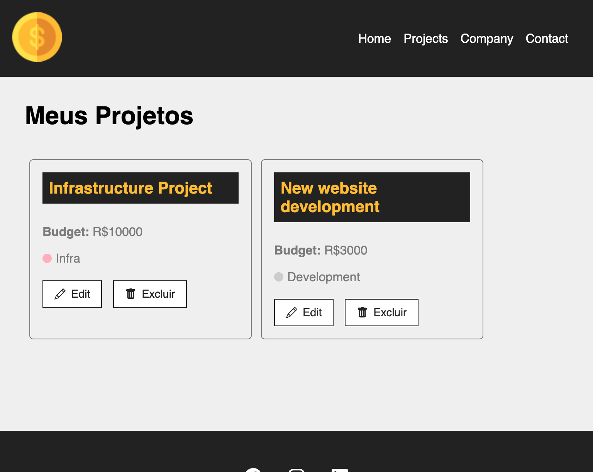

# 🎯 wddm-120-create-and-read-app

This is the assigment 2 of the curse Web Application Programming.
The goal is develop an app capable to create and read records. 

In this task an application will be created containing front-end and back-end code development with Firebase. In this application, the user must be able to create a new record and later read a record.

In this README.md you will know about these sections:  
- [x] 1. App Title: Contains a description of what the app does and optional background info.
- [x] 2. Screenshot(s): A screenshot of your app’s landing page and any other screenshots of interest.
- [x] 3. Technologies Used: List of the technologies used.
- [x] 4. Getting Started: Include a link to the deployed app and your Issues board with the project’s planning.
- [x] 5. Next Steps: Planned future enhancements.
- [x] 6. Frequent commits date back to the very beginning of the project.  

Given this information above, here are the sections for to read and know more about this repo.  

## 1️⃣  App Title
Mine app receive the name "Costs", since it has the purpose of calcule and crontrol the costs of any project.

## 2️⃣ Screenshots
More screenshots are available in this repo, under the folder /imgs. Follow belowa single screen shot with the main page of the app - Projets

## 3️⃣ Technologies Used
To develop this app, is used the following technologies: 
- React
- Fake Json server. This server was used because it is able to run call such as GET, POST, PUT, PATCH and DELETE. Unforntunetaly changes aren't persisted between calls.

## 4️⃣ Getting Started
Github Pages is able to deal with static pages. To be able to persist data, was used the fake json server. You can check out the application in the following link: 
🔗 [Costs project](https://viviurbano.github.io/wddm-120-create-and-read-app/)

## 5️⃣ Next steps
- [ ] Replace Fake Json server for Firebase
- [ ] Add login step component, using user and login to authenticate all users.
- [ ] Develop and add data in page Company.  
- [ ] Develop and add data in page Contact.  
- [ ] Add Bootstrap to have a better layout.  
- [ ] Change Footer, letting data better organized and structured.  

## 6️⃣ Commits
Please, take a look at commits history: 
🔗 [Link to commits history](https://github.com/viviurbano/wddm-120-create-and-read-app/commits/main)

- Scripts to run this project in your environment

First of all, download the project or do a fork. Open in a Visual Studio Code. Open the termina, in the project directory, you can run:
`npm start`

Runs the app in the development mode.\
Open [http://localhost:3000](http://localhost:3000) to view it in your browser.
